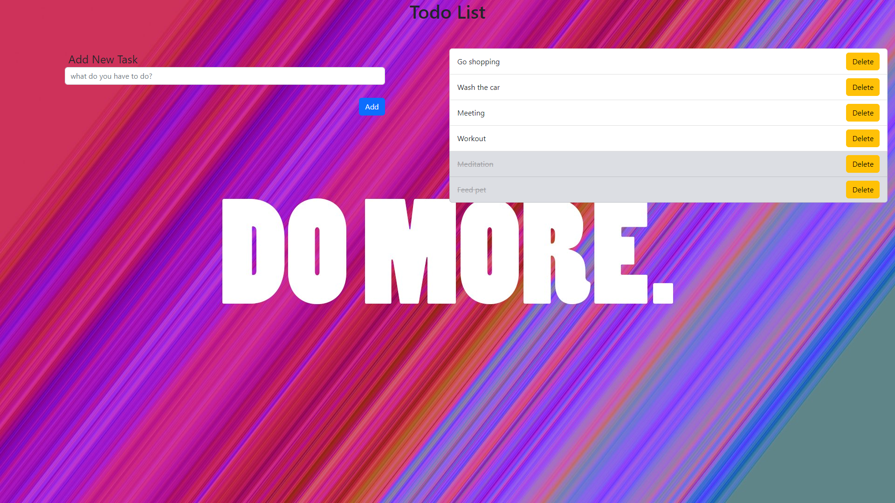

# TODO List

A todo list i made for learn some React basic concepts.

## Description

A simple todo list. The functionality is quite simple: you can write tasks, which are then stored in local storage. Afterwards, you have the option to mark them as completed or delete them.


## Getting Started

Just clone the repository and run the commands:

```
npm install
```

and

```
npm run dev
```

## Author

[Yaco Cappelletti Arias](https://www.linkedin.com/in/yaco-cappelletti-arias/)


